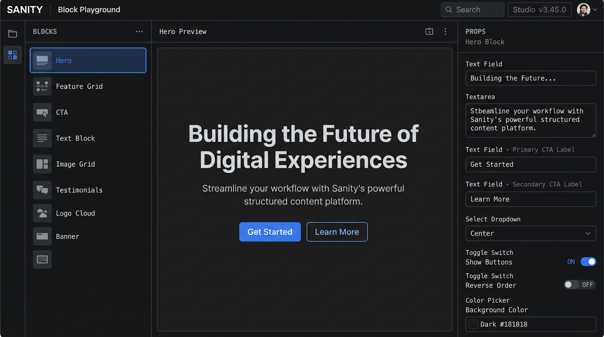

# @pipeville/sanity-block-playground-plugin

This plugin adds a **Block Playground** tool to your Sanity Studio: a panel where you browse section/block definitions, edit props (schema-driven fields or JSON), and preview the result **in Studio** (client blocks) or in an **iframe** pointed at your app (server blocks).

**Important:** Client preview components and server-only / RSC sections must live in **separate modules**. The Studio config must never import server components. This package uses `clientBlocks` (Studio-safe) and `serverBlocks` (metadata only); the iframe resolves real server components in your Next (or other) app via [`@pipeville/sanity-block-playground-plugin/preview`](#preview-entry-server--iframe).

Source: [pipeville/sanity-block-playground-plugin](https://github.com/pipeville/sanity-block-playground-plugin). Releases publish to npm from Git tags.



## Install

```bash
pnpm add @pipeville/sanity-block-playground-plugin
```

Peer dependencies (align with your Studio):

| Package         | Version   |
| --------------- | --------- |
| `sanity`        | `^5.0.0`  |
| `react`         | `^19.0.0` |
| `react-dom`     | `^19.0.0` |
| `@sanity/ui`    | `^3.1.14` |
| `@sanity/icons` | `^3.7.4`  |

## Minimal setup (client-only)

1. **Client registry** — only imports client-safe section components:

```ts
// sections/block-playground-client.ts
import type { ClientBlockDefinition } from "@pipeville/sanity-block-playground-plugin";
import { HeroSection } from "./hero/HeroSection";

export const clientBlocks: ClientBlockDefinition[] = [
  {
    name: "hero",
    label: "Hero",
    category: "Marketing",
    component: HeroSection,
    defaultProps: { title: "Hello", subtitle: "Subtitle" },
    stories: [],
    fields: [],
  },
];
```

2. **`sanity.config.ts`**:

```ts
import { defineConfig } from "sanity";
import { blockPlaygroundPlugin } from "@pipeville/sanity-block-playground-plugin";
import { clientBlocks } from "./sections/block-playground-client";

export default defineConfig({
  // ...
  plugins: [
    blockPlaygroundPlugin({
      clientBlocks,
    }),
  ],
});
```

Use **`defineBlockPlayground`** if you prefer a named wrapper with the same options type.

## Full setup: client + server blocks + schema types

### Why two lists?

- **`clientBlocks`** — each entry includes a `component` rendered inside Studio. Must not pull in server-only or Next RSC entrypoints.
- **`serverBlocks`** — metadata only (no `component`). Preview uses an iframe; components are resolved **only** in your app route (see [Preview entry](#preview-entry-server--iframe)).

The sidebar shows **one unified list** (client entries first, then server, in registration order). Categories are sorted alphabetically unless you pass **`categoryOrder`**.

Server-only setups can use **`clientBlocks: []`** and put every iframe block under **`serverBlocks`**.

### Studio config example

```ts
// sanity.config.ts
import { defineConfig } from "sanity";
import {
  blockPlaygroundPlugin,
  pickSchemaTypesByName,
} from "@pipeville/sanity-block-playground-plugin";
import { link } from "@/cms/schemas/objects/link";
import { portableText } from "@/cms/schemas/objects/portableText";
import { schemaTypes } from "@/cms/schemas";
import { clientBlocks } from "@/sections/block-playground-client";
import { serverBlocks } from "@/sections/block-playground-server-meta";

export default defineConfig({
  plugins: [
    blockPlaygroundPlugin({
      title: "Sections",
      clientBlocks,
      serverBlocks,
      serverPreviewBasePath: "/block-preview",
      categoryOrder: ["Marketing", "Content"],
      namedSchemaTypes: pickSchemaTypesByName(schemaTypes, [
        "link",
        "portableText",
      ]),
    }),
  ],
});
```

`pickSchemaTypesByName` builds the flat `namedSchemaTypes` map from your existing `schema.types` array so nested portable text / link fields get the right inputs.

### Server block metadata (Studio — no server imports)

```ts
// sections/block-playground-server-meta.ts
import type { ServerBlockMetadata } from "@pipeville/sanity-block-playground-plugin";

export const serverBlocks: ServerBlockMetadata[] = [
  {
    name: "serverHero",
    label: "Server hero",
    category: "Marketing",
    defaultProps: { title: "From server" },
    stories: [],
    fields: [],
  },
];
```

Do **not** import RSC or `next/*` here.

## Preview entry (server / iframe)

Import **`@pipeville/sanity-block-playground-plugin/preview`** only from your **app** (e.g. Next route), not from `sanity.config.ts`.

Exports:

| Export | Purpose |
| ------ | ------- |
| `serializeBlockPreviewSearchParams` | Query string for `block` + `props` (single encoding; safe with `URLSearchParams`) |
| `parseBlockPreviewSearchParams` | Parse from `URLSearchParams` or Next `searchParams` |
| `mergePreviewProps` | Shallow merge: URL props override default top-level keys |
| `resolveServerBlock` | Look up a component from a `Record<blockName, Component>` registry |

### Next.js `/block-preview` page

Use the same `serverPreviewBasePath` as in the plugin (e.g. `/block-preview`). The plugin builds URLs like `/block-preview?block=…&props=…` using the shared serializer.

```tsx
// app/block-preview/page.tsx
import { notFound } from "next/navigation";
import {
  mergePreviewProps,
  parseBlockPreviewSearchParams,
  resolveServerBlock,
} from "@pipeville/sanity-block-playground-plugin/preview";
import { getDefaultPropsForBlock } from "@/sections/block-playground-shared";
import { serverComponents } from "@/sections/server-components-registry";

type Props = {
  searchParams: Promise<{ block?: string; props?: string }>;
};

export default async function BlockPreviewPage({ searchParams }: Props) {
  const sp = await searchParams;
  const { block: blockName, props: parsed } = parseBlockPreviewSearchParams(sp);

  if (!blockName) notFound();

  const Component = resolveServerBlock(blockName, serverComponents);
  if (!Component) notFound();

  const defaults = getDefaultPropsForBlock(blockName);
  const props = mergePreviewProps(defaults, parsed);

  return <Component {...props} />;
}
```

- **`serverComponents`** — defined in a file that **only** your Next server bundle imports; keep it separate from `block-playground-client.ts`.
- **Next 15+** uses async `searchParams`; adjust for your version.
- **`getDefaultPropsForBlock`** — keep defaults in sync with `serverBlocks[].defaultProps` (often shared constants or a small shared module with **no** React server imports if imported from Studio metadata).

### URL length

`props` is JSON in the query string. Very large payloads can exceed browser URL limits; keep previews reasonably sized.

## Plugin options

| Option | Type | Description |
| ------ | ---- | ----------- |
| `title` | `string` | Tool title (default `"Blocks"`). |
| `clientBlocks` | `ClientBlockDefinition[]` | **Required.** In-Studio preview components + defaults, stories, fields per block. |
| `serverBlocks` | `ServerBlockMetadata[]` | Optional iframe-only blocks (no `component` here). |
| `categoryOrder` | `string[]` | Order category headings; others follow alphabetically. |
| `serverPreviewBasePath` | `string` | e.g. `/block-preview`; builds iframe URL with canonical query (omit if you only use client blocks). |
| `buildServerPreviewUrl` | `(args) => string \| null` | Override full URL; if set, **`serverPreviewBasePath` is ignored**. |
| `namedSchemaTypes` | `Record<string, unknown>` | Named Sanity type definitions for nested form fields. |

Per-block fields (on both client and server metadata):

- `name`, `label`, `category?`, `hasSchema?`
- `defaultProps` — when no story is selected or as base for merging in your preview route
- `stories` — `{ id, label, props }[]`; selecting a story **replaces** the full props object (same as before).
- `fields` — `BlockFieldDefinition[]` for the Fields tab; empty → JSON only.

### Server preview without URL config

If a **server** block is selected but neither `serverPreviewBasePath` nor `buildServerPreviewUrl` is set, the tool shows a short message instead of falling back to a client component.

## Story helper (`defineSectionStories`)

```ts
import { defineSectionStories } from "@pipeville/sanity-block-playground-plugin/define-section-stories";

export const heroStories = defineSectionStories([
  { id: "a", label: "A", props: { title: "A" } },
]);
```

Attach `stories` on the relevant `ClientBlockDefinition` or `ServerBlockMetadata`.

## Migration from 0.3.x

| Old | New |
| --- | --- |
| `getBlocks()` returning `preview: { mode: "client" \| "server" }` | Split into **`clientBlocks`** (with `component`) and **`serverBlocks`** (metadata only). `render` is derived: server metadata ⇒ iframe. |
| `getDefaultProps` / `getStories` / `getFieldDefinitions` | Per-block **`defaultProps`**, **`stories`**, **`fields`** on each definition. |
| `resolveComponent` | **`component`** on each `ClientBlockDefinition`. |
| `buildServerPreviewUrl` only | Prefer **`serverPreviewBasePath`** + shared serialization; or keep **`buildServerPreviewUrl`** for full control. |
| Manual `encodeURIComponent(JSON.stringify(props))` inside `URLSearchParams` | **Do not** double-encode; use **`serializeBlockPreviewSearchParams`** (or rely on `serverPreviewBasePath`). |

## Limitations

- **Client** sections run in Studio’s React tree — no RSC as the preview root, no server-only modules in the client registry file.
- **`React.lazy`** client previews are supported (`ClientPreviewComponent`); the tool wraps the client preview in **`Suspense`** with a short loading state.
- **Iframe** preview needs your app running and reachable (dev server or deploy).
- **`namedSchemaTypes`** is a name → type map for the playground form, not a full `schema.types` array.
- **`mergePreviewProps`** is shallow; nested objects are replaced by top-level keys from the URL when present.
- **`parseBlockPreviewSearchParams`** accepts `URLSearchParams`, plain `searchParams` objects, or any value with a `.get(name)` API (e.g. `ReadonlyURLSearchParams`).

## Repository metadata (GitHub)

- **Description:** Block Playground for Sanity Studio — edit section props with client or iframe (Next) preview.
- **Website:** [npm](https://www.npmjs.com/package/@pipeville/sanity-block-playground-plugin)
- **Topics:** `sanity`, `sanity-plugin`, `cms`, `studio`, `nextjs`, `blocks`
